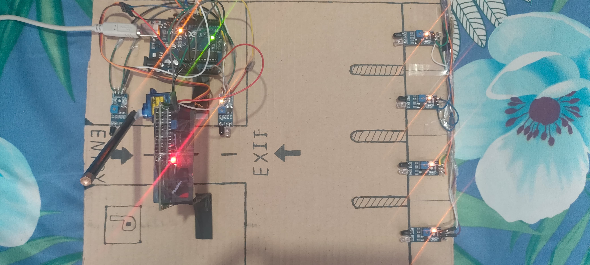

# Smart Parking System Using Arduino 🚗

An automated parking system using Arduino, IR sensors, and an LCD display to manage parking slots efficiently.

---

## 📋 Features
- Real-time parking slot monitoring
- Automated entry/exit with servo motor
- LCD display for slot availability
- Cost-effective and scalable

## 🛠️ Installation & Setup
### Hardware Components
- Arduino Uno
- IR Sensors (x4)
- Servo Motor (SG90)
- 16x2 LCD Display
- Jumper Wires

### Software
1. Install [Arduino IDE](https://www.arduino.cc/en/software).
2. Upload the code from `Code/smart_parking.ino`.

## 🎥 Working Mechanism
1. IR sensors detect vehicle entry/exit.
2. Servo motor opens/closes the gate.
3. LCD updates available slots in real-time.
4. The gate doesn't open when the slots are full for incoming vehicle.

## 🚀 Future Enhancements
- Mobile app for remote monitoring
- IoT-based data tracking
- Smart payment integration

## 👥 Contributors
- [Vivekananda G C](https://github.com/vivek2004-vk)

